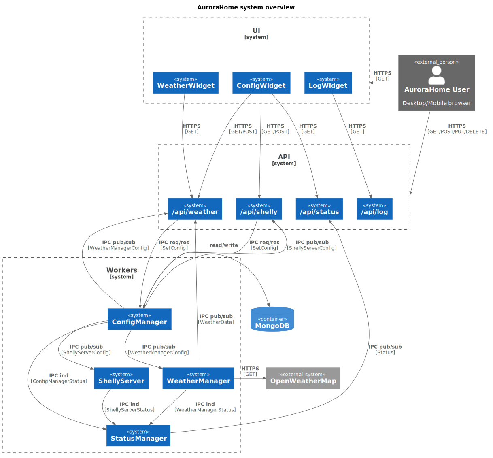

# System Overview

The image below gives a brief overview of all components in the AuroraHome system.

Dive deeper into the components of AuroraHome

* [Status Manager](https://github.com/sanderveldhuis/aurorahome/blob/main/doc/technical/status-manager.md)
* [Config Manager](https://github.com/sanderveldhuis/aurorahome/blob/main/doc/technical/config-manager.md)
* [Weather Manager](https://github.com/sanderveldhuis/aurorahome/blob/main/doc/technical/weather-manager.md)
* [Shelly Server](https://github.com/sanderveldhuis/aurorahome/blob/main/doc/technical/shelly-server.md)
